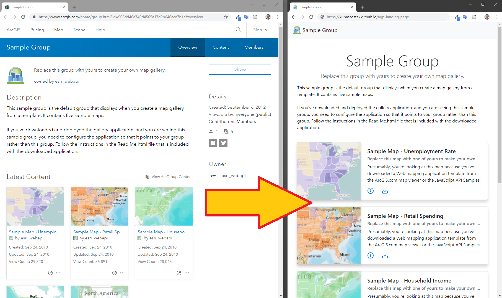

# Landing Page for ArcGIS Portal group

This application changes [ArcGIS Portal](https://enterprise.arcgis.com/en/portal/latest/use/get-started-with-groups.htm)
or [ArcGIS Online](https://doc.arcgis.com/en/arcgis-online/get-started/get-started-with-groups.htm)
group into dedicated landing page. Instead of showing all portal elements like links to Gallery
or Members [Landing Page](https://github.com/kubaszostak/agp-landing-page) focuses only on your Group content.

This application was inspiredy by [Minimal Gallery](https://github.com/Esri/minimal-gallery) from Esri.
I found Minimal Gallery code so overcomplicated that it was easier for me creating new application
rather than adding two text elements (group snippet and group description) to existing
Minimal Gallery code. I ended with one [HTML](https://github.com/kubaszostak/agp-landing-page/blob/master/index.html)
file and one [TypeScript/JavaScript](https://github.com/kubaszostak/agp-landing-page/blob/master/ts/app.ts)
file + reference to bootstrap.css.

## How to use

1. [Download](https://github.com/kubaszostak/agp-landing-page/archive/master.zip) and put content
   of this repository on your server
2. Update [config.js](https://github.com/kubaszostak/agp-landing-page/blob/master/config.js)
   file with your ArcGIS Portal address and default group id (by default
   [Landing Page](https://github.com/kubaszostak/agp-landing-page) uses ArcGIS Online - https://www.arcgis.com).
3. If needed use URL parameters 'portalUrl' and 'group', eg.:
   - https://kubaszostak.github.io/agp-landing-page/?group=1d1f24e8556642f49448f1c88b5a571b
   - https://kubaszostak.github.io/agp-landing-page/?portalUrl=https://mapy.umgdy.gov.pl/portal&group=9227744bd89342429da120fb3bba224a